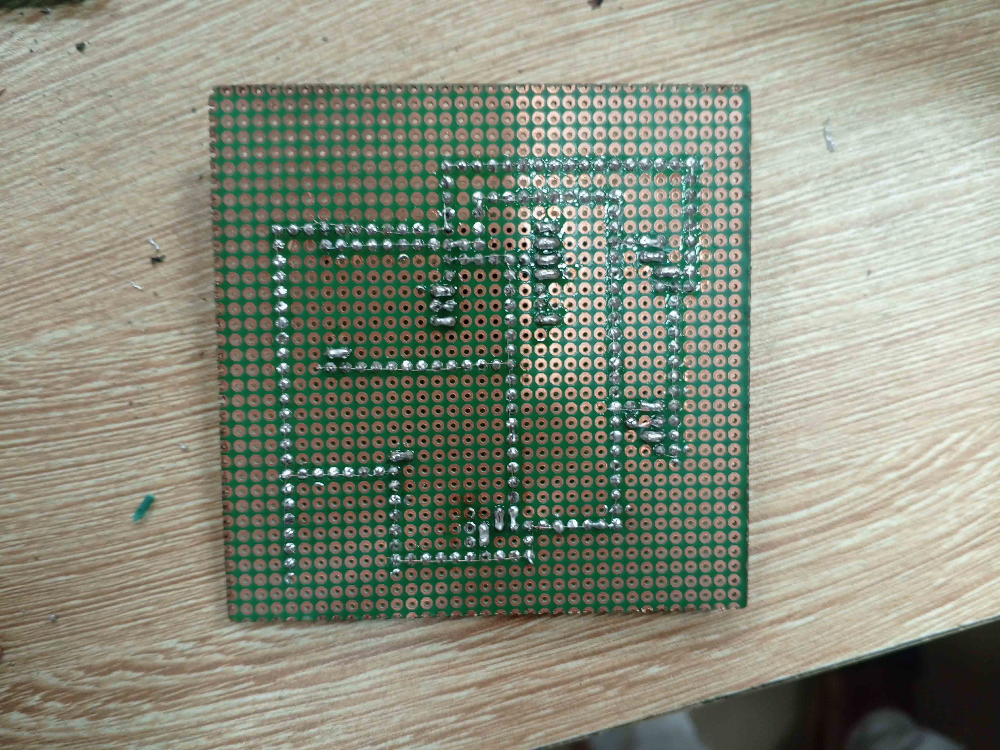
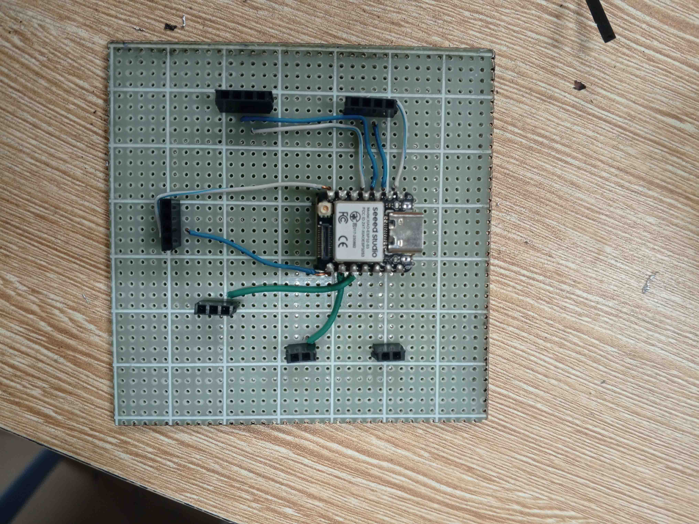

# **Journal du 17 septembre 2026 (rédigé par : GABLIBO Komi Armel)**

## **Atelier : MAQUETTE PÉDAGOGIQUE D’UN ÉTABLISSEMENT SCOLAIRE INTELLIGENT**

### **Activités**

La journée a été consacrée à la finalisation du projet, notamment :
- la conception et la découpe d'une nouvelle plaquette PCB en raison des erreurs commises la veille, puis le perçage et la soudure des broches ;
- le câblage des composants et leur soudage ;
- une réunion avec tout le personnel afin de bien clôturer cette journée et bien commencer celle de demain.

- Les derniers câblages de notre maquette
- Optimisation et finalisation du PCB (Assisté par un des formateur)
- conception et impression du dtf comme la cour de l'etblissement scolaire
-  finalisation de la partie electronique

les images: 

.jpeg)
.jpeg)

## **Appris**

- comment s'adapter à des situations complexes ou à des changements de dernières minutes dans un bref delai.
hier mon equipe et moi avions eu un problème de PCB çoncus dans Kicad, alors il fallu refaire un autre PCB sur perforé

 - Nous avons appris à réaliser un bon soudage afin d'éviter les courts-circuits et d'obtenir un rendu très professionnel.

## **Raté, puis corrigé**
Nous avons eu un court-circuit qui a brûlé tous nos composants, notamment le Xiao et le relais. Comme solution, nous avons refait un nouveau PCB de zéro grâce à l'aide apportée par les formateurs. Les deux plaquettes que nous avions réalisées n'étaient pas bonnes, ce qui nous a contraints à changer une autre plaquette qui était perforée. Grâce à l'aide de Monsieur KPADENOU N'KULETE H. Arnaud, nous avons réussi à résoudre ce problème, car il a personnellement réalisé la soudure et le raccordement.

|  |
| --- |
|  |

|  |
| --- |
|  |

Le test ne fonctionnait plus lorsque le relais était dans le circuit. Nous avons donc supprimé ce relais, qui était endommagé.

## **Décidé**
- Reprendre à zéro le PCB afin d'obtenir un résultat plus propre et plus compréhensible.
- Nous avions à faire plusieurs test sur les led , le relais et l'afficheur qui autre fois etais mal cnnecté. au final le relais ne repondais plus et la luminosité des led etait devenue faible caar elles sont branché direcetement sur XIAO qui leur fournisait 3.3v

## **À faire demain**
Présentation du projet devant les jurys et fin de la formation.
